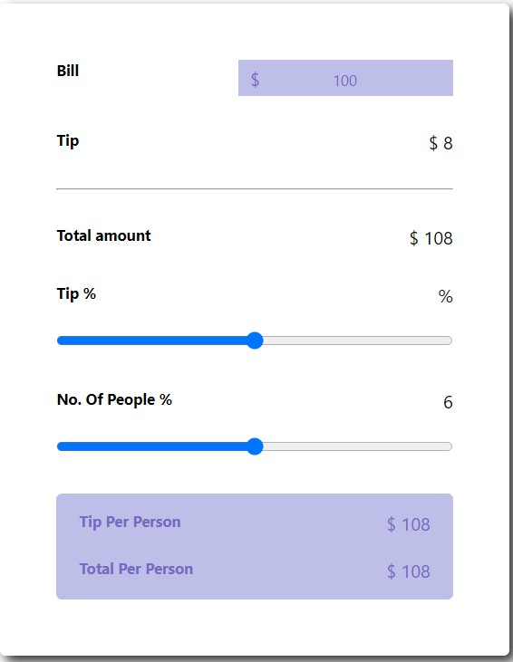

# Bill Project

> an automatic bill that gives the exact money for each person in the table
> Live demo [_here_](https://github.com/splach-coder/Bill-Receipt.git).

## Table of Contents

- [General Info](#general-information)
- [Technologies Used](#technologies-used)
- [Screenshots](#screenshots)
- [Project Status](#project-status)
- [Room for Improvement](#room-for-improvement)
- [Acknowledgements](#acknowledgements)
- [Contact](#contact)
<!-- * [License](#license) -->

## General Information

- an automatic bill that gives the exact money for each person in the table .
- The app devides the money for each person in the table and the tip either.

## Technologies Used

- Tech 1 - HTML 5
- Tech 2 - CSS 3
- Tech 3 - Java Script

## Screenshots

## Project Status

Project is: _no longer being worked on_.

## Room for Improvement

Room for improvement:

- Improvement to stylish

## Acknowledgements

- Many thanks to me

## Contact

Created by [@anas.ben](https://www.instagram.com/) - feel free to contact me!
